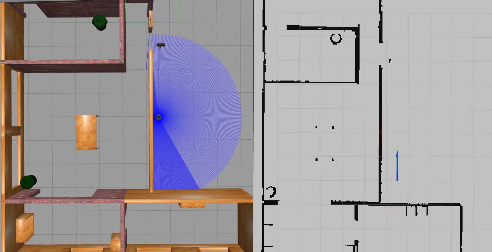
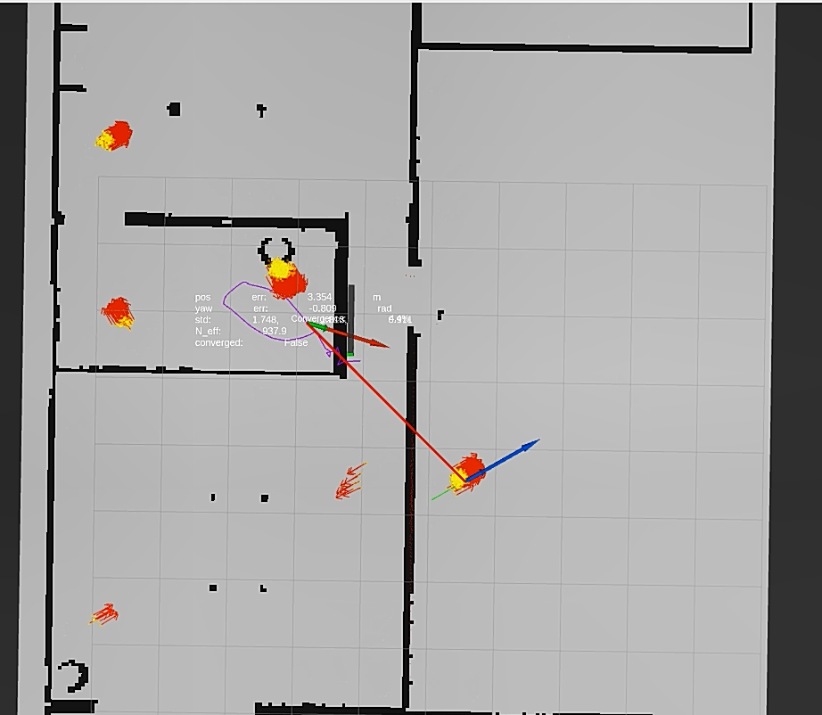
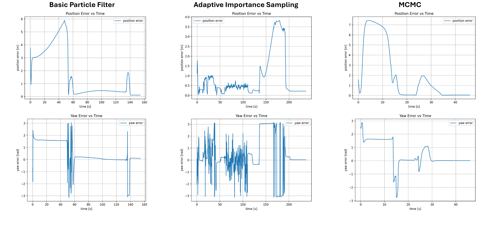
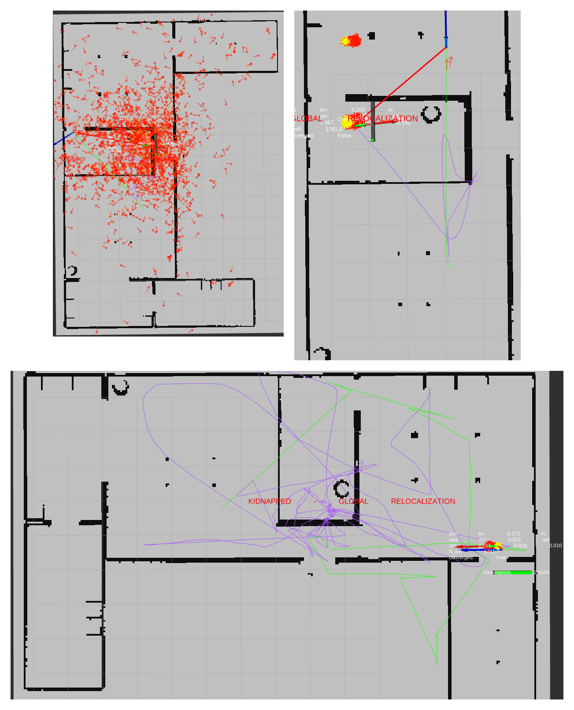
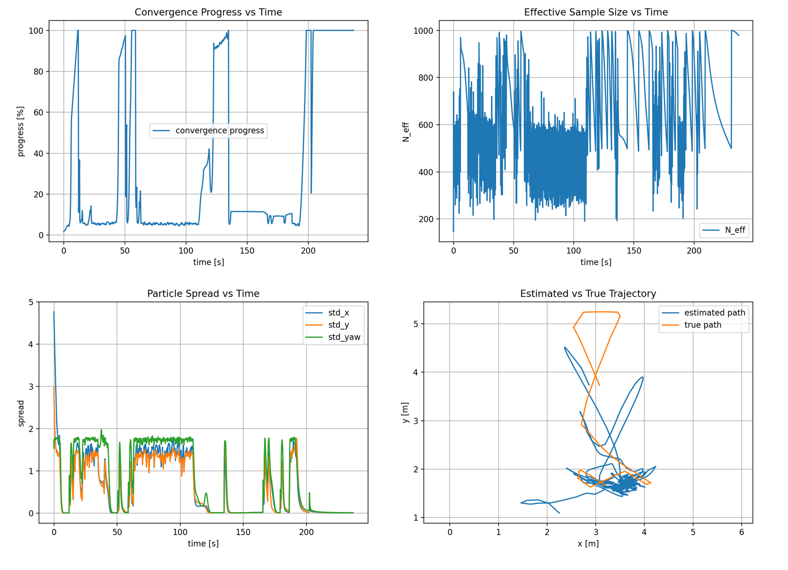

# TurtleBot3 Global Localization with Particle Filters

**ROS 2 · TurtleBot3 Burger · Gazebo · LiDAR · Monte Carlo Localization · MCMC**

A comparative robotics project implementing **three particle-filter-based localization methods** for a TurtleBot3 Burger in a known indoor environment. The system fuses wheel odometry and 2D LiDAR scans with an occupancy-grid map to estimate the robot's pose, evaluates accuracy and computational cost, and investigates recovery from the **kidnapped robot problem**.

The implementations are written in Python as ROS 2 nodes and include experiment launch files, RViz visualization topics, automated exploratory motion, CSV metric logging, and plotting utilities.

<p align="center">
  
</p>

<p align="center"><em>Gazebo environment and corresponding occupancy-grid map used for LiDAR-based localization.</em></p>

## Authors & Contributors

This project was jointly developed by:

- **[AmirHesam Kamalpour](https://github.com/AmirHesamKamalpour)**
- **[Aida roshani](https://github.com/Aaidaro)**

Both authors collaboratively contributed to the design, implementation, and development of this project.

School of Electrical and Computer Engineering, University of Tehran, 2026.

## Highlights

- **Global localization:** initialize particles throughout the free space of a known occupancy map without assuming a known starting pose.
- **Three approaches:** baseline particle filter, effective-sample-size (ESS) adaptive resampling, and an ESS-triggered resample-move particle filter using Metropolis–Hastings updates.
- **Sensor fusion:** probabilistic odometry motion model and likelihood-field LiDAR observation model.
- **Kidnapping experiments:** simulated robot relocation, mismatch detection, and global particle reinitialization.
- **Evaluation:** position/yaw errors, convergence behavior, particle diversity, per-scan processing time, and MCMC acceptance rate.
- **Visual diagnostics:** particle clouds, estimated/ground-truth trajectories, live ROS topics, and generated plots.

<p align="center">
  
</p>

<p align="center"><em>RViz visualization of pose hypotheses and filter state during global localization.</em></p>

### Compared Methods

| Method | Resampling / refinement | Main trade-off |
| --- | --- | --- |
| **Basic Particle Filter** | Systematic resampling at a fixed interval | Straightforward reference implementation |
| **Adaptive Particle Filter** | Systematic resampling when $N_\mathrm{eff}$ falls below a threshold | Avoids unnecessary resampling and helps preserve diversity |
| **MCMC Particle Filter** | ESS-triggered resampling followed by Metropolis–Hastings particle moves | Local particle refinement at additional computational cost |

The adaptive implementation changes **when resampling occurs**; it does not dynamically change the total number of particles or implement a separate adaptive importance proposal.

## Experimental Results

The accompanying report compares the three methods in a simulated TurtleBot3 house environment. The following are **reported averages across three runs per method**, not results independently reproduced from this repository checkout.

| Metric | Basic PF | Adaptive PF | MCMC PF |
| --- | ---: | ---: | ---: |
| Position RMSE (m) ↓ | 3.151 | **2.360** | 3.723 |
| Convergence time (s) ↓ | 126.597 | 143.799 | **48.016** |
| Final position error (m) ↓ | 0.175 | 0.131 | **0.0627** |
| Processing time per filter step (ms) ↓ | 15.13 | **14.39** | 18.28 |

**Key finding:** the adaptive variant achieved the lowest overall position RMSE and lowest processing cost, whereas MCMC achieved the shortest reported convergence time and smallest final position error. A lower final error does **not** imply a lower RMSE over the entire run.



*Example position and orientation error traces from the supplied experiments. The figure's label “Adaptive Importance Sampling” refers to the ESS-based adaptive-resampling implementation discussed above; it is not a separate importance-sampling proposal. Plots depict example runs rather than the across-run summary in the table.*

## Repository Structure

```text
.
├── lidar_analysis_py/                 # ROS 2 Python package
│   ├── launch/
│   │   ├── pf_experiment.launch.py    # Selects basic / adaptive / mcmc
│   │   ├── kidnap.launch.py           # Relocates the Gazebo robot
│   │   └── pf_plot.launch.py          # Plots logs using preset paths
│   ├── lidar_analysis_py/
│   │   ├── basic_particle_filter_node.py
│   │   ├── particle_filter_node.py   # ESS-based adaptive resampling
│   │   ├── mcmc_particle_filter_node.py
│   │   ├── pf/
│   │   │   ├── map_utils.py
│   │   │   ├── motion_model.py
│   │   │   ├── observation_model.py
│   │   │   ├── resampling.py
│   │   │   └── metrics.py
│   │   ├── pf_explore_motion_node.py
│   │   ├── pf_error_plotter.py
│   │   ├── randomize_robot_pose.py
│   │   └── calibrate_truth_transform.py
│   ├── package.xml
│   ├── setup.py
│   └── test/
├── report.pdf                          # Detailed project report
└── README.md
```

**Not included in the supplied archive:** the `maps/explore_house.yaml` and `maps/explore_house.pgm` files, external TurtleBot3 packages, and recorded experiment logs. They must be supplied separately to reproduce the original environment and results.

## Requirements

The original workflow uses a **TurtleBot3 Burger in Gazebo with ROS 2** and the classic Gazebo ROS interfaces (`/spawn_entity` and `/delete_entity`). A ROS 2 Humble / Ubuntu 22.04 environment with compatible TurtleBot3 simulation packages is a reasonable starting point; other versions have **not been validated** here.

- ROS 2 (`rclpy`, standard message packages, `tf2_ros`, `rviz2`, and `colcon`)
- TurtleBot3 and TurtleBot3 Gazebo simulation packages, including `turtlebot3_gazebo`
- `gazebo_msgs` and working Gazebo entity spawn/delete services for relocation experiments
- Python packages: `numpy`, `scipy`, `Pillow`, `PyYAML`, and `matplotlib`
- An occupancy-map YAML and image aligned with the simulated world
- For the report's ground-truth-based evaluation: a publisher of `/ground_truth_odom` and an appropriate world-to-map transform

Refer to the [ROS 2 colcon tutorial](https://docs.ros.org/en/humble/Tutorials/Beginner-Client-Libraries/Colcon-Tutorial.html) and [ROBOTIS TurtleBot3 simulation guide](https://emanual.robotis.com/docs/en/platform/turtlebot3/simulation/) to set up the underlying ROS/simulator environment.

## Installation

1. Install and source your ROS 2 distribution and TurtleBot3 Gazebo dependencies.
2. Clone this repository into the `src` directory of a ROS 2 workspace:

   ```bash
   mkdir -p ~/tb3_projects_ws/src
   cd ~/tb3_projects_ws/src
   git clone <YOUR_REPOSITORY_URL>
   ```

3. Build the package and source the workspace:

   ```bash
   cd ~/tb3_projects_ws
   source /opt/ros/humble/setup.bash
   rosdep install --from-paths src --ignore-src -r -y
   colcon build --symlink-install --packages-select lidar_analysis_py
   source install/setup.bash
   export TURTLEBOT3_MODEL=burger
   ```

4. Place the map files at `~/tb3_projects_ws/maps/explore_house.yaml` and `~/tb3_projects_ws/maps/explore_house.pgm`, or use your own compatible occupancy map. The image referenced by the YAML must resolve correctly.

> **Path configuration:** The experiment launcher defaults to `/root/tb3_projects_ws/maps/explore_house.yaml`. Override `map_yaml_path` as shown below when running from another account. The kidnapping and plotting launchers also contain `/root/tb3_projects_ws` paths; see [Reproducibility Notes](#reproducibility-notes).

## Running an Experiment

**Terminal 1 — start Gazebo** (after sourcing ROS 2, the workspace, and setting `TURTLEBOT3_MODEL=burger`):

```bash
ros2 launch turtlebot3_gazebo turtlebot3_house.launch.py
```

**Terminal 2 — start one localization method:**

```bash
source /opt/ros/humble/setup.bash
source ~/tb3_projects_ws/install/setup.bash
export TURTLEBOT3_MODEL=burger

# Baseline
ros2 launch lidar_analysis_py pf_experiment.launch.py \
  mode:=basic map_yaml_path:=$HOME/tb3_projects_ws/maps/explore_house.yaml

# OR: ESS-adaptive resampling
ros2 launch lidar_analysis_py pf_experiment.launch.py \
  mode:=adaptive map_yaml_path:=$HOME/tb3_projects_ws/maps/explore_house.yaml

# OR: MCMC resample-move filter
ros2 launch lidar_analysis_py pf_experiment.launch.py \
  mode:=mcmc map_yaml_path:=$HOME/tb3_projects_ws/maps/explore_house.yaml
```

Run **only one filter variant at a time** for a comparable experiment. By default, `pf_experiment.launch.py` also requests an initial randomized pose, publishes a static map-to-odom transform, starts exploratory robot motion, and launches RViz. Set `randomize:=false`, `run_motion:=false`, or `run_rviz:=false` to disable those optional behaviors.

The supplied experiment launcher enables **ground-truth-dependent convergence checks**. Ensure `/ground_truth_odom` is available and correctly aligned with the map for comparable evaluation. If using the filter without ground truth, adjust `debug_require_truth_error_for_convergence` in the launch configuration or run the filter node with this parameter disabled; do not interpret such convergence times as equivalent to the reported experiment.

### Kidnapped Robot Experiment

Start a filter with detection enabled:

```bash
ros2 launch lidar_analysis_py pf_experiment.launch.py \
  mode:=mcmc \
  map_yaml_path:=$HOME/tb3_projects_ws/maps/explore_house.yaml \
  kidnap_detection_enabled:=true
```

After the filter has converged, trigger a simulated relocation from another terminal:

```bash
ros2 launch lidar_analysis_py kidnap.launch.py
```

The relocation tool deletes and respawns the TurtleBot3 at a randomized collision-free pose. The filter can detect inconsistencies using odometry jumps and scan-match deterioration, then reinitialize its particle cloud across the map.

<p align="center">
  
</p>

<p align="center"><em>Kidnapped-robot experiment: global particle redistribution, relocalization, and recovery.</em></p>

**Important:** `kidnap.launch.py` currently hardcodes the map path, model name, and truth offsets inside its `Node` parameters, even though it declares corresponding launch arguments. Update these constants for your workspace before running it.

### Metrics and Plots

Each variant writes timestamped CSV files into its own directory under `~/tb3_projects_ws/log/`:

| Mode | Default CSV directory | ROS topic prefix |
| --- | --- | --- |
| `basic` | `pf_basic_runs/` | `/basic_pf` |
| `adaptive` | `pf_runs/` | `/pf` |
| `mcmc` | `pf_mcmc_runs/` | `/mcmc_pf` |

For example, generate plots from the latest MCMC run:

```bash
ros2 run lidar_analysis_py pf_error_plotter -- \
  --latest \
  --log-dir "$HOME/tb3_projects_ws/log/pf_mcmc_runs" \
  --out-dir "$HOME/tb3_projects_ws/log/pf_mcmc_plots"
```

The plotter produces position/yaw error, effective sample size, particle spread, convergence progress, processing time, and estimated-versus-ground-truth trajectory plots. The `pf_plot.launch.py` shortcut is also available, but its log/output paths currently assume `/root/tb3_projects_ws`.



*Example diagnostic plots: convergence progress, effective sample size, particle spread, and estimated versus ground-truth trajectory.*

## ROS Interfaces and Parameters

**Core inputs:** `/odom` (`nav_msgs/Odometry`), `/scan` (`sensor_msgs/LaserScan`), and (for evaluation) `/ground_truth_odom` (`nav_msgs/Odometry`).

**Outputs:** `/map`, plus per-method pose, particle cloud, path, convergence, error, effective sample size, scan-match, and processing-time topics. For example, the adaptive filter publishes `/pf/estimated_pose`, `/pf/particle_poses`, `/pf/estimated_path`, `/pf/converged`, `/pf/neff`, and `/pf/processing_time_ms`. The MCMC filter also publishes `/mcmc_pf/mcmc_acceptance_rate`.

| Launch argument | Default | Purpose |
| --- | --- | --- |
| `mode` | `adaptive` | `basic`, `adaptive`, or `mcmc` |
| `n_particles` | `2000` | Number of pose hypotheses |
| `beam_step` | `8` | Laser beam subsampling interval |
| `max_beams` | `150` | Maximum beams scored per scan |
| `resample_period` | `5` | Periodic resampling for the basic filter |
| `resample_neff_fraction` | `0.5` | ESS trigger relative to the particle count |
| `mcmc_iterations` | `2` | MH refinement iterations |
| `mcmc_proposal_xy_std` | `0.04` | MCMC position proposal standard deviation (m) |
| `mcmc_proposal_yaw_std` | `0.08` | MCMC heading proposal standard deviation (rad) |
| `kidnap_detection_enabled` | `false` | Enable recovery monitoring |

See `lidar_analysis_py/launch/pf_experiment.launch.py` and the filter node implementations for additional parameters, including motion noise, scan model, convergence thresholds, and ground-truth alignment.

## Reproducibility Notes

- **Missing map:** The original `explore_house.yaml` / `.pgm` files are not packaged; a different map or simulator layout will change the experiment.
- **Ground-truth alignment:** The report uses a Gazebo-to-map pose offset (`truth_x_offset`, `truth_y_offset`, `truth_yaw_offset`). These defaults are specific to the original environment and should be recalibrated for other maps/worlds.
- **Convergence measurement:** The supplied experiment launch file requires both particle-spread criteria and sufficiently low error relative to ground truth. This makes convergence an evaluation-specific metric, not an entirely ground-truth-free stopping rule.
- **Absolute paths:** Some launch configurations and log-directory settings assume the original `/root/tb3_projects_ws` workspace. Override or update them before reproducing experiments on another machine.
- **Package metadata:** `package.xml` and `setup.py` still contain placeholder description/maintainer/license metadata. `setup.py` also lists some legacy console entry points whose Python modules are absent from this archive; clean these entries up before distributing the package.
- **Validation scope:** Python source files were inspected for syntax, but the full ROS 2/Gazebo workflow and published numerical results have not been rerun in an independent environment.
